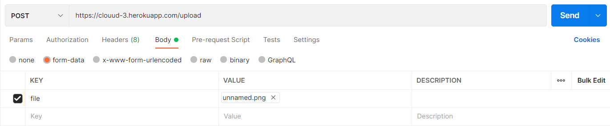

# File management with S3

**Task: Create REST API what will provide access to file and folders. Node.js should proxy requests to S3.**

## Application Usage

### Link of the S3 bucket

https://clouud-3.herokuapp.com

### Upload file on S3 bucket

### Download file from S3 bucket

### List of the S3 bucket

